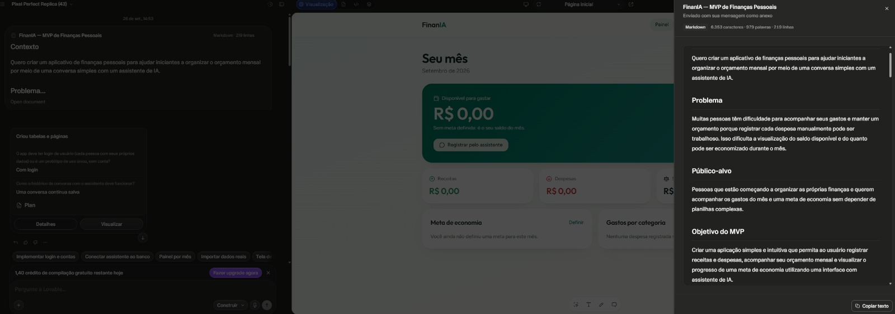
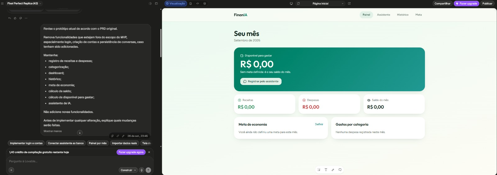

# 💰 FinanIA — Organização de Finanças Pessoais com IA

> Um aplicativo de organização financeira desenvolvido utilizando Vibe Coding e Lovable, com foco em simplicidade, linguagem natural e experiência prática para o usuário.

## 🎯 Sobre o projeto

O FinanIA é um aplicativo de organização de finanças pessoais criado para facilitar o registro e acompanhamento da vida financeira.

A proposta é permitir que o usuário registre receitas e despesas de forma simples, inclusive utilizando linguagem natural, reduzindo a necessidade de preencher formulários complexos.

O projeto foi desenvolvido como parte do desafio da DIO sobre Vibe Coding, utilizando a IA como parceira durante a criação, planejamento, implementação e validação do MVP.

## 🚨 Problema

Muitas pessoas têm dificuldade para manter uma organização financeira porque aplicativos tradicionais podem exigir muitos campos, categorias e lançamentos manuais.

A proposta do FinanIA é tornar esse processo mais simples e natural, permitindo que o usuário interaja com o aplicativo de maneira mais próxima de uma conversa.

## 💡 Solução

O FinanIA permite:

- Registrar receitas e despesas;
- Utilizar linguagem natural para informar movimentações;
- Classificar automaticamente as transações;
- Visualizar o resumo financeiro;
- Acompanhar histórico de movimentações;
- Criar e acompanhar uma meta financeira;
- Utilizar um Assistente Financeiro;
- Visualizar informações de forma simples e organizada.

## ✨ Funcionalidades

### 💬 Registro em linguagem natural

O usuário pode informar uma movimentação de forma simples, por exemplo:

> "Gastei R$ 45 no supermercado."

O sistema interpreta a informação e registra a despesa.

### 📊 Painel financeiro

Apresenta um resumo das movimentações, incluindo receitas, despesas, saldo e informações relacionadas à organização financeira.

### 🤖 Assistente Financeiro

Permite interagir com um assistente para obter orientações e informações relacionadas à organização das finanças.

### 🎯 Meta financeira

O usuário pode definir uma meta e acompanhar seu progresso.

### 📜 Histórico

Permite visualizar as movimentações registradas no aplicativo.

## 🖥️ Telas do aplicativo

O MVP possui as seguintes áreas principais:

- **Painel** — visão geral da situação financeira;
- **Assistente** — interação com o Assistente Financeiro;
- **Histórico** — visualização das movimentações;
- **Meta** — definição e acompanhamento de objetivo financeiro.

## 🧠 Vibe Coding

O projeto foi desenvolvido utilizando o conceito de **Vibe Coding**, no qual a pessoa descreve sua intenção, problema e resultado esperado em linguagem natural e utiliza ferramentas de IA para transformar essas instruções em uma solução funcional.

Durante o desenvolvimento, o Lovable foi utilizado para:

- Criar a estrutura inicial do aplicativo;
- Desenvolver as telas;
- Implementar funcionalidades;
- Ajustar o escopo do MVP;
- Corrigir comportamentos;
- Realizar testes;
- Refinar a interface.

## 📝 PRD / Prompt final

### Contexto

Quero criar um aplicativo chamado FinanIA para organização de finanças pessoais.

O aplicativo deve permitir que o usuário registre receitas e despesas de maneira simples, utilizando linguagem natural, evitando formulários complexos e tornando o controle financeiro mais acessível.

### Problema

Muitas pessoas abandonam o controle financeiro porque aplicativos tradicionais exigem muitos lançamentos manuais e possuem interfaces complexas.

Quero criar uma experiência simples, intuitiva e amigável que facilite o registro das movimentações e permita acompanhar a situação financeira.

### Público-alvo

Pessoas que desejam começar ou melhorar a organização das próprias finanças, principalmente usuários que procuram uma solução simples e fácil de utilizar.

### Funcionalidades principais

1. Registrar receitas e despesas utilizando linguagem natural.
2. Classificar automaticamente as movimentações.
3. Exibir um painel com resumo financeiro.
4. Permitir criação e acompanhamento de metas financeiras.
5. Disponibilizar um Assistente Financeiro.
6. Exibir histórico das movimentações.
7. Criar uma interface responsiva e simples de utilizar.

### Escopo do MVP

O MVP deve ser simples e funcional.

Não implementar:

- Login;
- Cadastro de usuários;
- Integração bancária;
- Open Finance;
- Pagamentos;
- Aplicativos nativos;
- Sistemas externos complexos.

Os dados devem ser armazenados localmente no navegador para manter o projeto simples e adequado ao objetivo do MVP.

### Experiência desejada

A interface deve ser moderna, limpa, intuitiva e responsiva.

O usuário deve conseguir registrar uma movimentação sem precisar preencher diversos campos manualmente.

### Entregável

Criar um protótipo funcional do FinanIA utilizando Vibe Coding e Lovable, permitindo testar o fluxo principal de organização financeira.

## 🧪 Testes realizados

Durante o desenvolvimento foram realizados testes de:

- Registro de despesas;
- Registro de receitas;
- Classificação das movimentações;
- Atualização do painel;
- Criação de meta financeira;
- Consulta do histórico;
- Interação com o Assistente Financeiro;
- Persistência dos dados no navegador;
- Ajustes visuais da interface.

Um dos testes realizados foi:

> "Gastei R$ 45 no supermercado."

O aplicativo registrou a movimentação como despesa na categoria de alimentação e atualizou o painel financeiro.

## 📸 Interações com a IA

Durante o desenvolvimento foram realizadas diversas interações com o Lovable.

Entre elas:

- Criação do conceito do FinanIA;
- Definição das funcionalidades;
- Criação da estrutura do MVP;
- Ajustes no escopo;
- Implementação do Assistente Financeiro;
- Testes de receitas e despesas;
- Correções e ajustes da interface;
- Validação do comportamento do aplicativo.

### Registros visuais

#### 🚀 Primeira interação com o Lovable

O primeiro prompt apresentou o contexto, problema, público-alvo e objetivo do MVP.

#### 🔧 Revisão do MVP

Nesta etapa, o protótipo foi revisado de acordo com o PRD original. Foram removidas funcionalidades que estavam fora do escopo do MVP.

> 📌 Esses registros mostram parte do processo de desenvolvimento utilizando Vibe Coding e interação com Inteligência Artificial.

## 🌐 Aplicação publicada

O FinanIA está disponível online:

👉 [**Abrir o FinanIA**](https://finania-app.lovable.app)

## 💾 Armazenamento

Para manter o MVP simples, os dados financeiros e a meta são armazenados localmente no navegador.

Isso significa que os dados permanecem disponíveis no mesmo navegador/dispositivo, mas não existe sincronização entre diferentes dispositivos.

## 🛠️ Tecnologias e ferramentas

- Lovable
- Vibe Coding
- Inteligência Artificial
- GitHub
- Markdown
- Aplicação Web
- Armazenamento local do navegador

## 📚 O que aprendi

O desenvolvimento do FinanIA mostrou que criar uma solução utilizando IA depende muito mais da clareza da comunicação do que simplesmente pedir para a ferramenta "criar um aplicativo".

Durante o projeto, percebi a importância de definir primeiro o problema, o público, as funcionalidades e principalmente o limite do MVP.

Também aprendi que as respostas da IA precisam ser testadas e avaliadas. Algumas funcionalidades inicialmente criadas precisaram ser ajustadas para manter o projeto dentro do escopo planejado.

O processo de Vibe Coding tornou possível transformar uma ideia em um protótipo funcional utilizando instruções em linguagem natural e ciclos de teste e melhoria.

## 🎓 Reflexão final

O projeto foi uma experiência prática sobre como utilizar inteligência artificial como parceira no processo de desenvolvimento.

O que funcionou bem foi a capacidade de transformar ideias descritas em linguagem natural em componentes e funcionalidades do aplicativo.

O que não funcionou perfeitamente foi a necessidade de revisar algumas decisões tomadas pela IA e controlar o escopo do projeto. Em alguns momentos foi necessário orientar novamente a ferramenta para evitar funcionalidades que não faziam parte do MVP.

O principal aprendizado foi entender que Vibe Coding não significa simplesmente deixar a IA fazer tudo. É necessário saber explicar o que se deseja, analisar o resultado, testar e orientar a IA novamente quando necessário.

## 🚀 Conclusão

O FinanIA representa um MVP de organização financeira criado com o apoio de ferramentas de Inteligência Artificial e utilizando os princípios de Vibe Coding.

O projeto demonstra como uma ideia pode ser transformada em uma aplicação funcional por meio de planejamento, prompts, interação com IA, testes e refinamentos.

---

**Projeto desenvolvido por Rodrigo Dominguez para o desafio da DIO — App de Organização de Finanças Pessoais com Vibe Coding.**
